# 🏗️ Diagramas de Arquitectura - MR CROC

## Diagrama de Arquitectura General

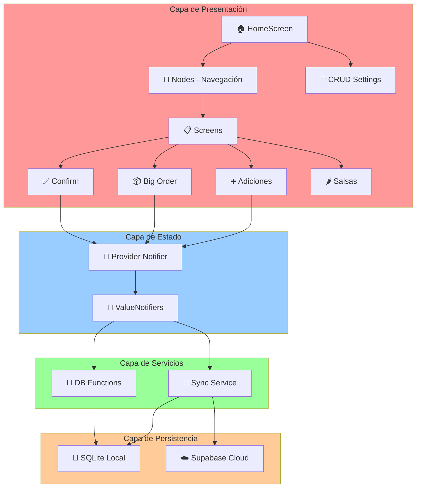

---

## Diagrama de Flujo de Datos

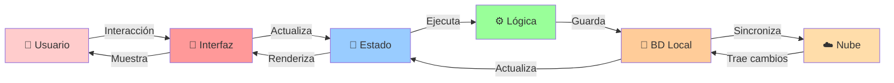

---

## Diagrama de Entidades (Modelos de Datos)

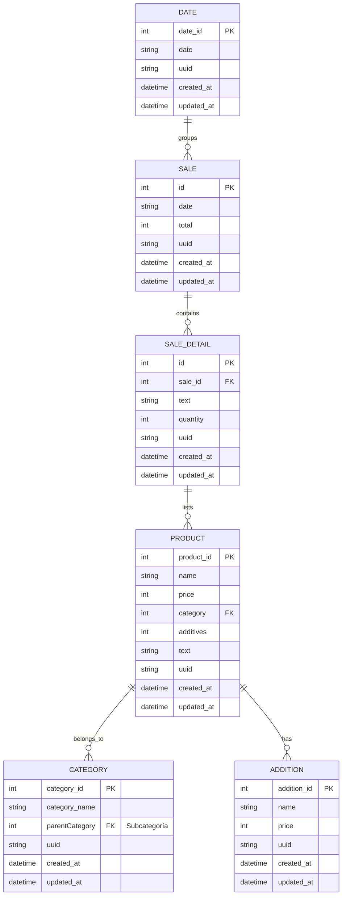

---

## Flujo de Creación de Pedido

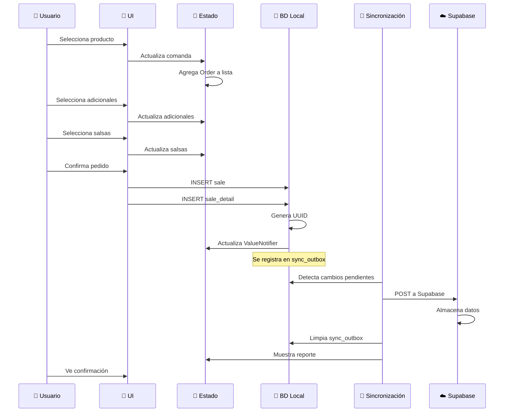

---

## Arquitectura de Carpetas Detallada

```mermaid
graph TB
    Root["📦 mr_croc"]
    
    Root --> Lib["lib/"]
    Root --> Assets["assets/"]
    Root --> Android["android/"]
    Root --> IOS["ios/"]
    Root --> Web["web/"]
    Root --> Config["Config Files"]
    
    Lib --> Main["main.dart 🚀"]
    Lib --> Database["database/"]
    Lib --> Models["models/"]
    Lib --> Provider["provider/"]
    Lib --> Screens["screens/"]
    Lib --> Services["services/"]
    Lib --> Widgets["widgets/"]
    
    Database --> DBFuncs["db_functions.dart"]
    
    Models --> ModelProd["model_product.dart"]
    Models --> ModelCat["model_category.dart"]
    Models --> ModelAdd["model_additions.dart"]
    Models --> ModelOrd["model_order.dart"]
    Models --> ModelOther["model_*.dart (otros)"]
    
    Provider --> ProvNotif["provider_notifier.dart"]
    
    Screens --> Home["homescreen.dart"]
    Screens --> Nav["navigation.dart"]
    Screens --> Nodos["nodes.dart"]
    Screens --> PantOtras["adiciones.dart, salsas.dart, etc."]
    Screens --> CRUDDB["crud-db/"]
    
    Services --> Sync["sync_service.dart"]
    
    Widgets --> WButton["buttonAdicion.dart"]
    Widgets --> WChart["chartPie.dart"]
    
    Assets --> AssetDB["cw_database.db"]
    Assets --> AssetIcon["icon/"]
    Assets --> AssetScreens["Screenshots/"]
    
    Config --> PubSpec["pubspec.yaml"]
    Config --> Analysis["analysis_options.yaml"]
    Config --> README["README.md"]
    Config --> IML["cw_3.iml"]
    
    style Root fill:#ffffcc
    style Lib fill:#ccffcc
    style Assets fill:#ccffff
    style Android fill:#ffcccc
    style IOS fill:#ffcccc
    style Web fill:#ffcccc
    style Config fill:#ffccff
```

---

## Diagrama de Estado (ValueNotifiers)

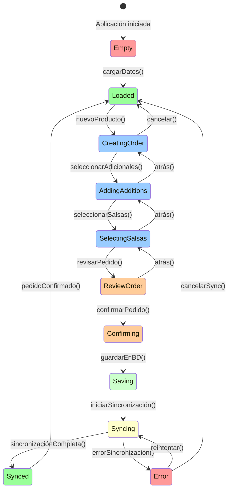

---

## Ciclo de Sincronización

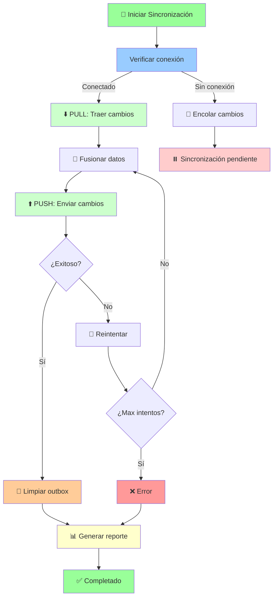

---

## Arquitectura de Componentes de UI

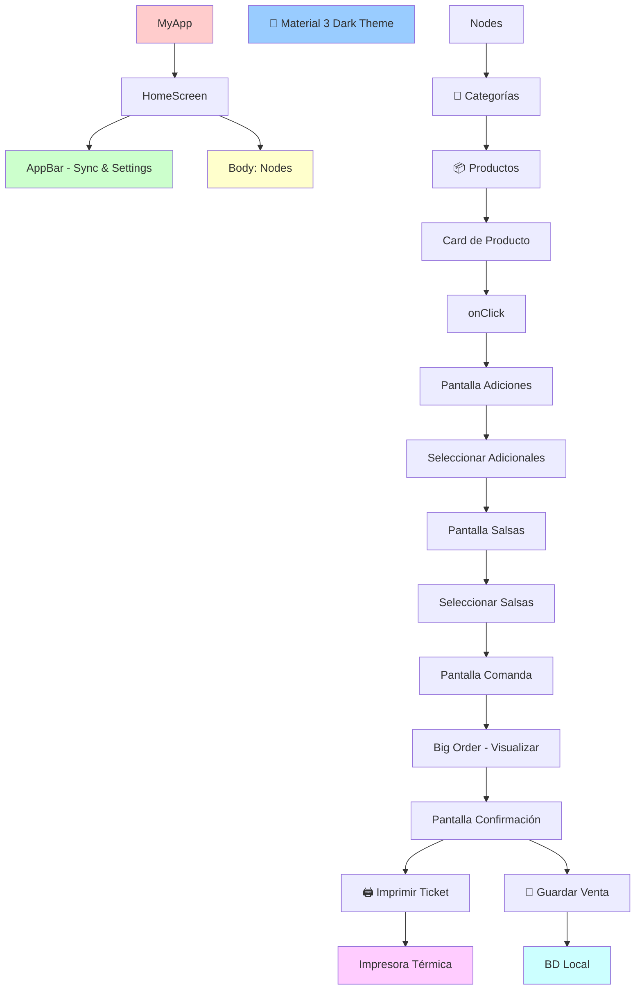

---

## Dependencias del Proyecto

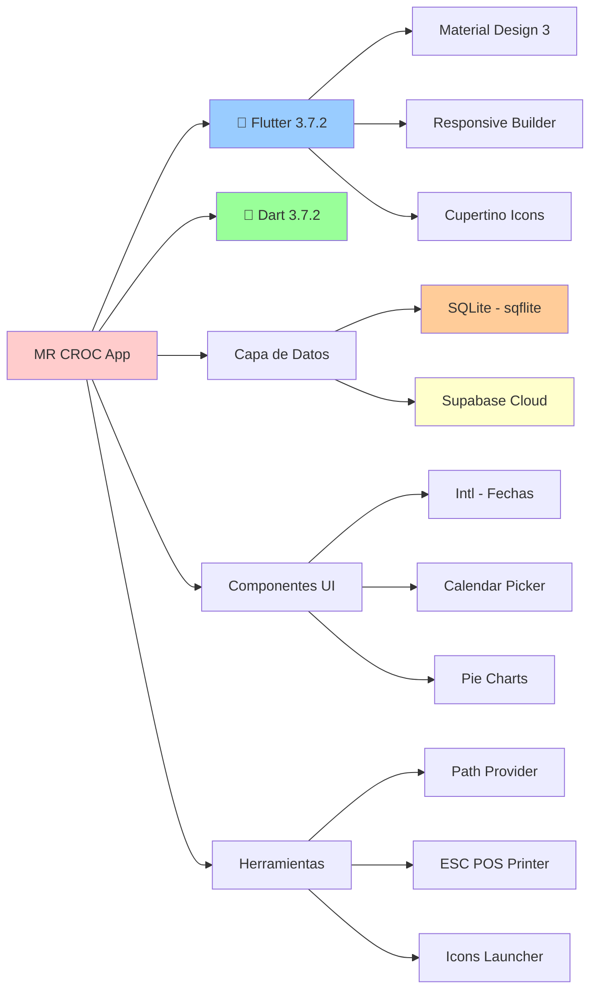

---

## Flujo de Inicialización de la Aplicación

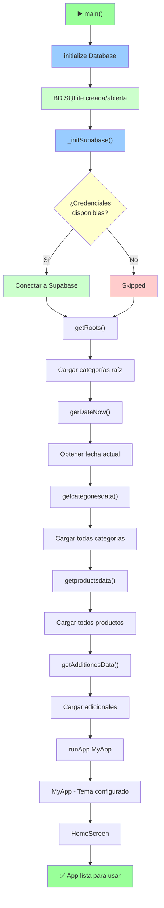

---

## Patrones de Diseño Utilizados

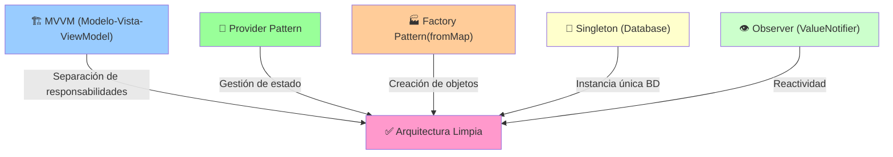

---

## Matriz de Responsabilidades

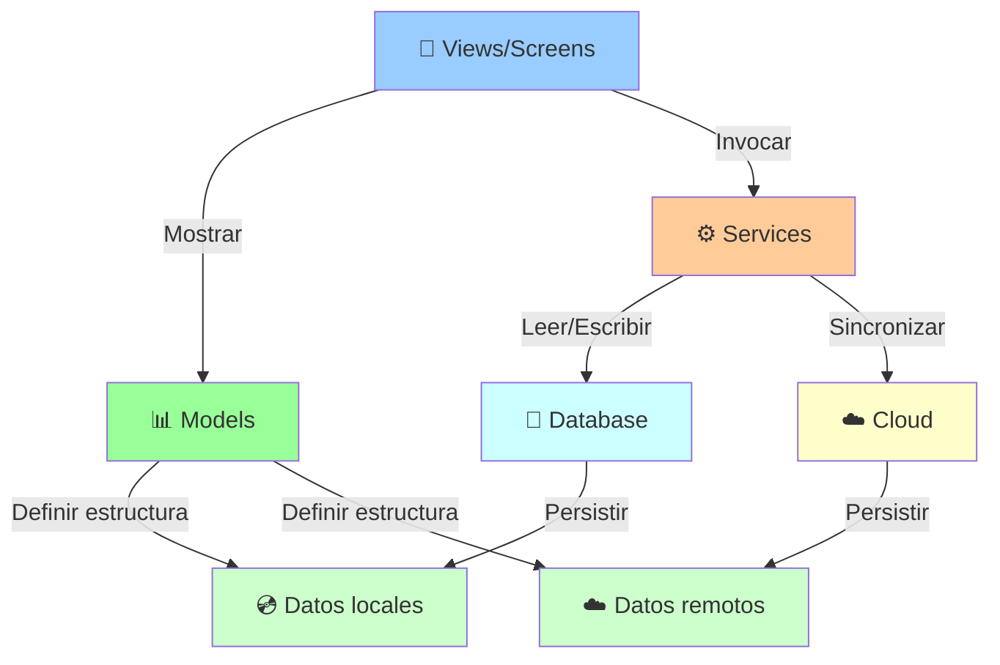

---

## Ciclo de Vida de un Pedido

```mermaid
stateDiagram-v2
    [*] --> Empty
    
    state Creación as Creación del Pedido
    Empty --> Creación: Usuario selecciona producto
    Creación --> Creación: Agregar adicionales
    Creación --> Creación: Agregar salsas
    Creación --> Creación: Ajustar cantidad
    
    Creación --> Cambio as Cambios en Comanda
    Cambio --> Cambio: Modificar cantidad
    Cambio --> Cambio: Eliminar producto
    Cambio --> Cambio: Agregar producto
    
    Cambio --> Revisión: usuario confirma
    Revisión --> Confirmado: Guardar en BD
    
    Confirmado --> Sincronización: Cambios en outbox
    Sincronización --> Sincronizado: Enviar a Supabase
    Sincronización --> Error: Falló sincronización
    
    Error --> Sincronización: Reintentar
    
    Sincronizado --> [*]
    Error --> Manual: Usuario resuelve
    Manual --> [*]

    style Creación fill:#99ccff
    style Cambio fill:#99ccff
    style Revisión fill:#ffcc99
    style Confirmado fill:#ccffcc
    style Sincronización fill:#ffffcc
    style Sincronizado fill:#99ff99
    style Error fill:#ff9999
    style Manual fill:#ffcccc
```

---

## Referencias Cruzadas de Módulos

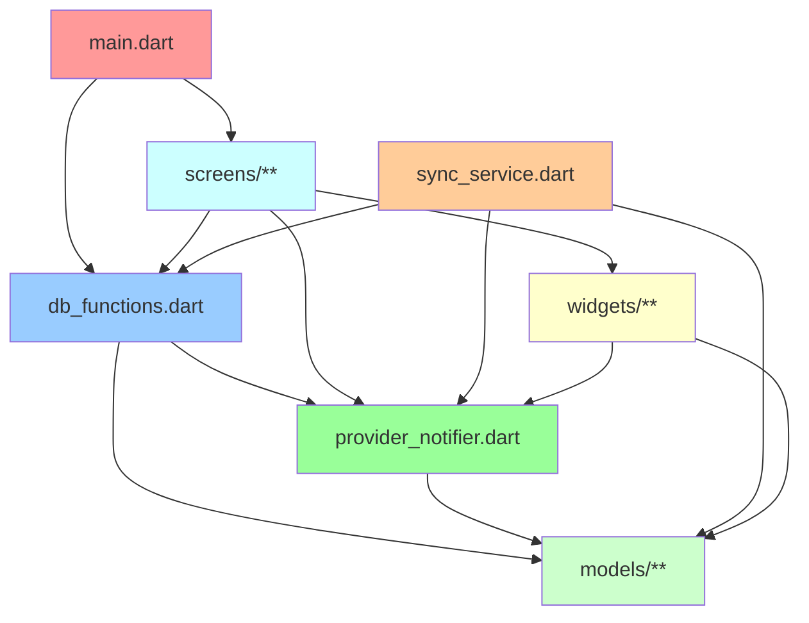

---

## Matriz de Tecnologías

| Aspecto | Tecnología | Versión |
|---------|-----------|---------|
| **Framework** | Flutter | ≥3.7.2 |
| **Lenguaje** | Dart | ≥3.7.2 |
| **BD Local** | SQLite | 2.3.0 |
| **BD Cloud** | Supabase | 2.8.0 |
| **Diseño** | Material 3 | Latest |
| **Responsive** | responsive_builder | 0.4.0 |
| **Internacionalización** | intl | 0.19.0 |
| **Gráficos** | pie_chart | 5.4.0 |
| **Impresión** | esc_pos_printer | 0.1.1 |

---

**Última actualización:** 21 de Marzo de 2026

