# 📊 Diagramas - Implementación CRUD Salsas

## Arquitectura de Implementación

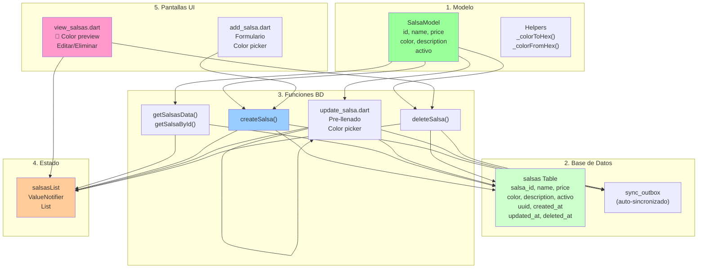

## Flujo de Datos: Crear Salsa

```mermaid
sequenceDiagram
    participant User as 👤 Usuario
    participant UI as 🎨 add_salsa.dart
    participant State as 🔔 salsasList
    participant DB as 💾 BD Local
    participant Outbox as 📦 sync_outbox
    participant Cloud as ☁️ Supabase

    User->>UI: Input: Nombre, Precio, Color
    UI->>UI: Validar formulario
    
    User->>UI: Clickear Guardar
    UI->>DB: createSalsa()
    Note over DB: Genera UUID y timestamp
    DB->>DB: INSERT INTO salsas
    DB->>Outbox: INSERT sync_outbox (INSERT op)
    
    DB->>State: Actualiza salsasList
    State->>UI: ValueNotifier notifica cambio
    UI->>UI: Pop y mostrar SnackBar ✅
    
    Note over Cloud: SyncService (background)
    Outbox->>Cloud: PUSH cambios a Supabase
    Cloud->>Outbox: ✅ Confirmación
    Outbox->>Outbox: Limpiar entrada
    
    style User fill:#ffcccc
    style UI fill:#99ccff
    style State fill:#ffcc99
    style DB fill:#ccffcc
    style Cloud fill:#ffffcc
```

## Flujo de Datos: Editar Salsa

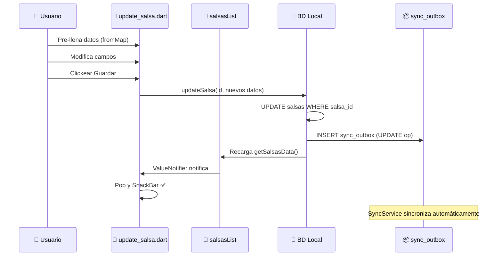

## Flujo de Datos: Eliminar Salsa

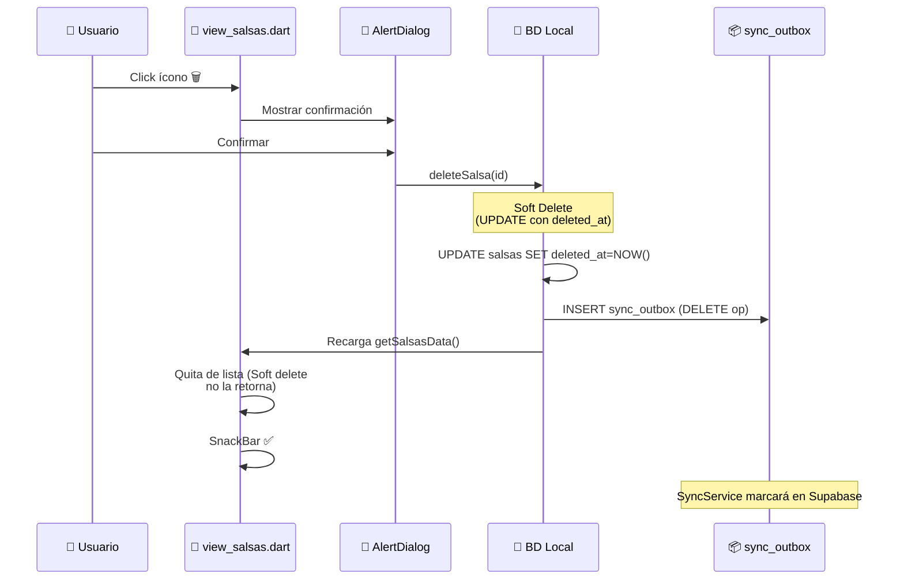

## Estados de Sincronización

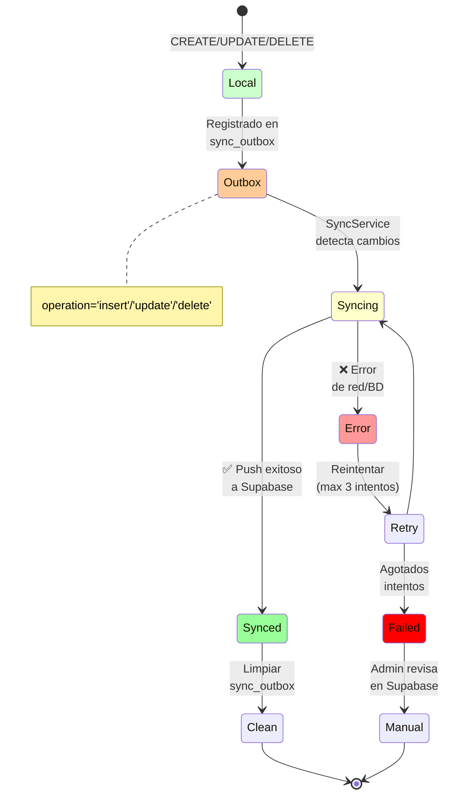

## Estructura de Carpetas Nueva

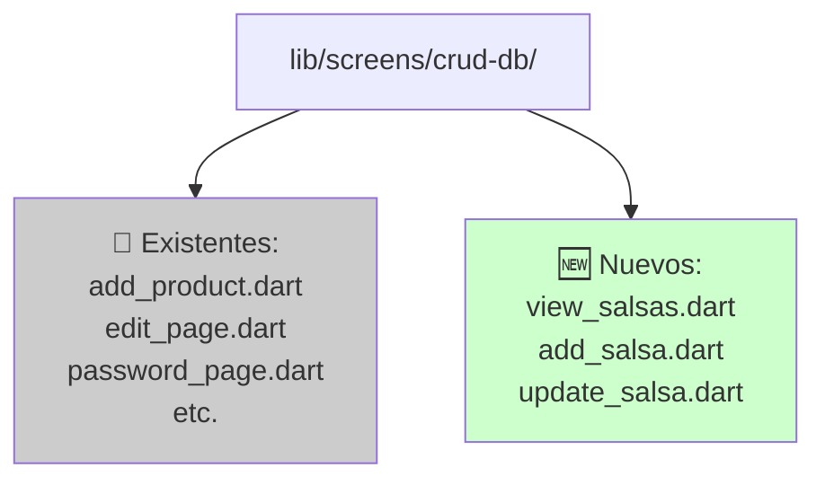

## Conversiones: Precio y Color

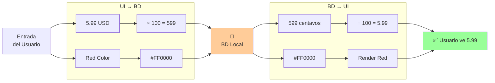

## Validación de Datos

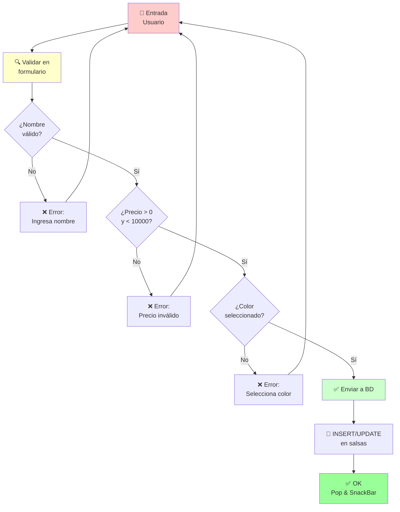

## Dependencia: flutter_colorpicker

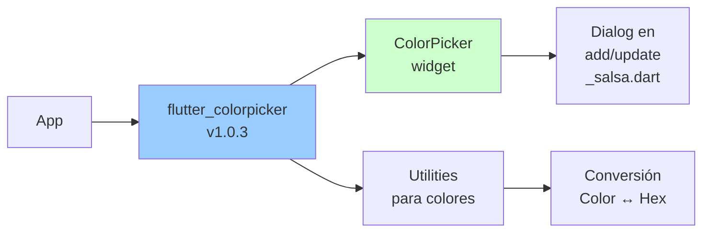

## Timeline: Cronograma

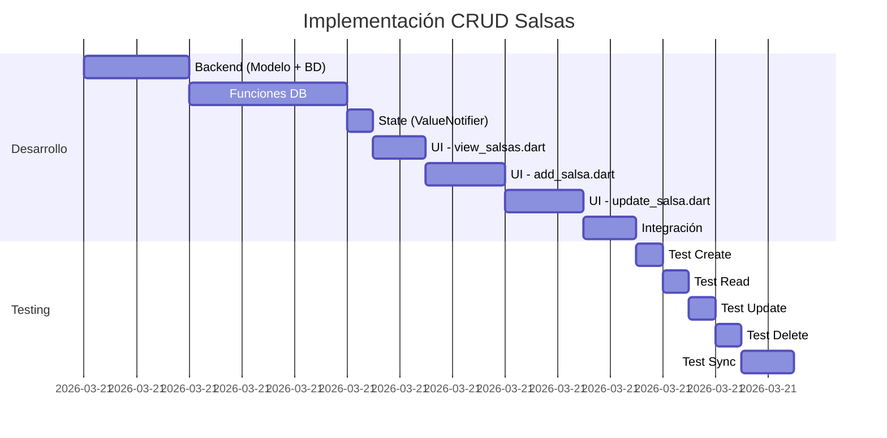

## Patrón CRUD: Comparación con Productos

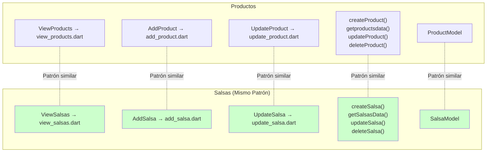

## Integración en Menú CRUD

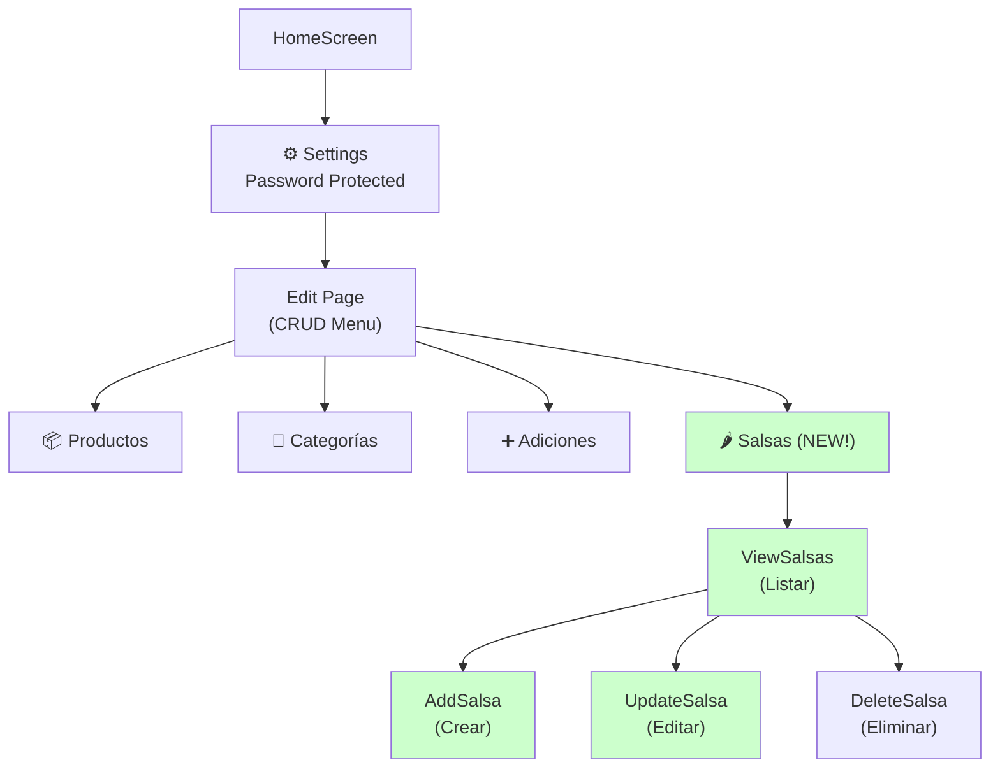

## Data Flow: Toda la Arquitectura

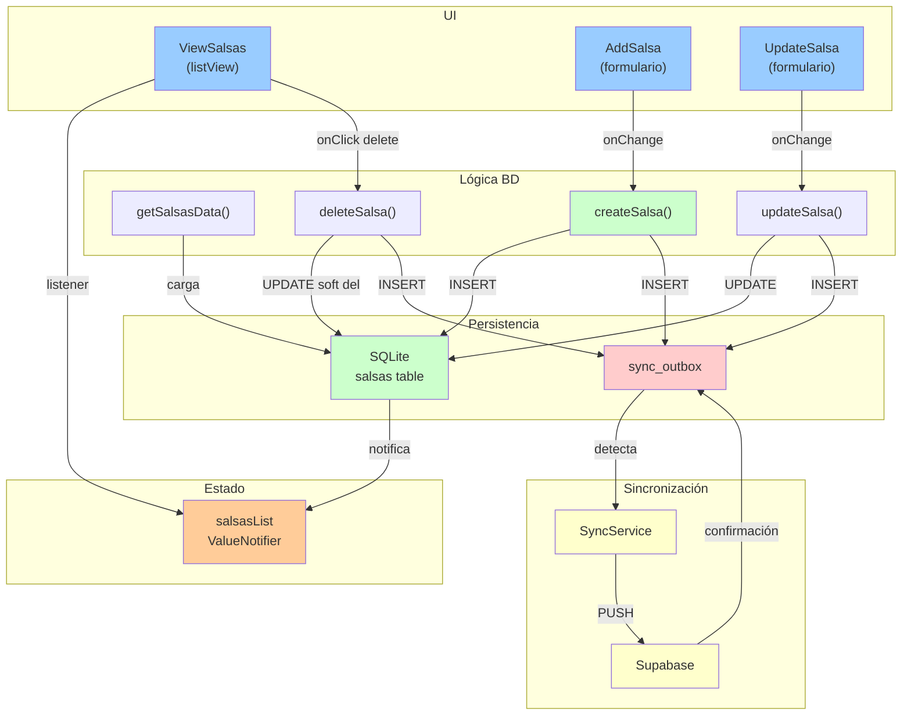

---

**Diagramas creados:** 21 de Marzo de 2026  
**Listos para referencia: ✅**

